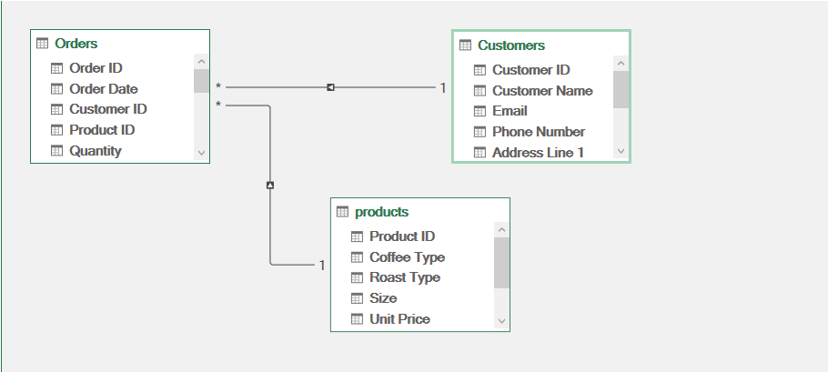
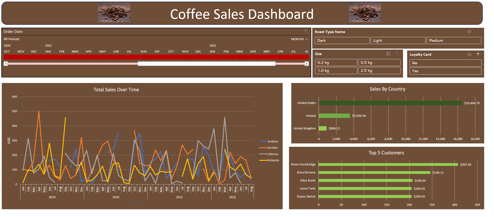

# Coffee Sales Dashboard
- [Introduction](#Introduction)
- [Data Model](#Data_Model)
- [Calcuations](#Calcuations)
- [Pivot Tables](#pivot_tables)
- [Dashboard](#Dashboard)
- [Insights](#Insights)
***

## Introduction 
The Data of A coffee sales conists of 3 main tables 
- Orders table
- Customer table
- products table

I will analyze the orders table and finally make an Excel Dashboard to show insights out of this data.

## Data_Model 

</img> 

2 main relations 
- 1 to many between customer and orders 
- 1 to many between products and orders

## Calculations 

This calculated coulmns are calucalted in the desired table `orders` these calculations made by these funtions `xlookup`,`vlookup` and `index(match)` to get data from related tables
also calculate `total sales` which will be used as main kpi by multiplying quantity by unit price.

## Pivot_Tables

I made 3 pivot tables to calcualte some specific information

- Total Sales by date 
- total sales grouped by country 
- Top 5 Customers 

## Dashboard

</img>

### Designing

1. Line Chart using the total sales vs date in months and years for every type of coffe we got using pivot takble as a      refernce and customize it by coffee color.
2. Bar chart for total sales over the country highlighted from highest to lowest.
3. Bar chart for top 5 customers.
4. TimeLine using date to control dates as filters also customize it
5. 3 slicers for Roast type, size of coffee and loyalty.

### Shapes and colors

all colors are choosed to fit the coffee color with hex #6F4E37
photo of coffee gathered from google photos

## Insights

- One of our most loyal customer Carolee Winchcombe tends tends to buy light coffe changed types from excelsa to robusta.
- 1 kg light coffee is the most selled.
- United states market is leading the sales in all the roast types and coffee types.
- Brenn Dundredge is one of our loyal customers that buys a lot from ligh 2.5 kg coffee tends to excelsa.
- The most selling year is 2021 and the most sales was libreca and excelsa peak month is november.
